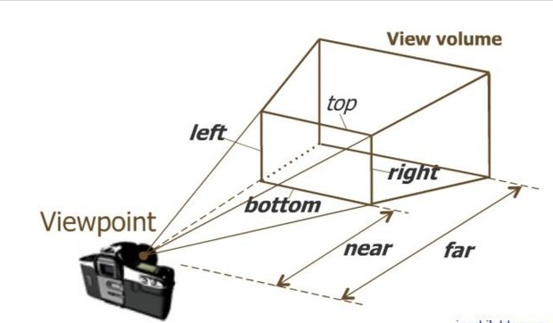
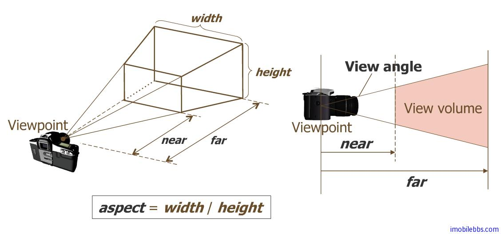
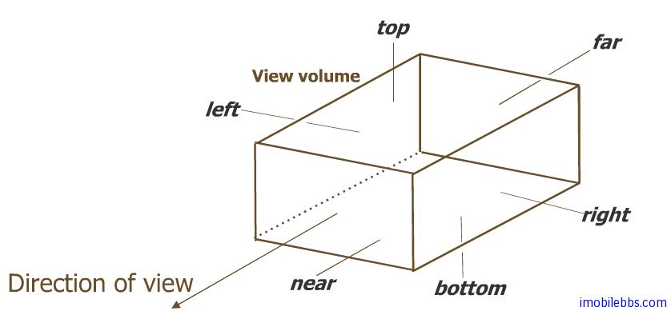
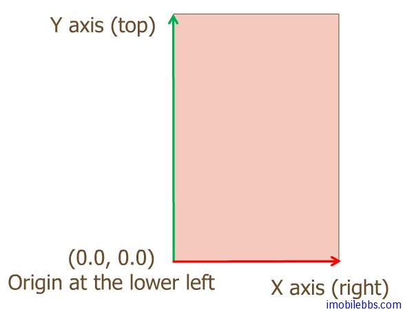
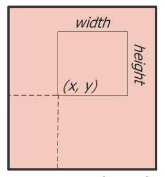

# OpenGLesDemos
Android OpenGLEs学习
### 一.基本概念
##### 1.什么是OpenGLEs
OpenGL ES(OpenGL for Embedded Systems)实际上就是OpenGL(Open Graphics Library)在移动端的阉割版.<br/>
OpenGL是跨编程语言、跨平台的编程接口或者叫图形库。
##### 2.EGL是什么
EGL主要负责初始化OpenGL的运行环境和设备间的交互，简单说就是OpenGL负责绘图EGL负责和设备交互。
##### 3.需要了解的知识

###### 坐标系 (x,y,z)
###### 线性代数
矩阵相乘,单元矩阵、转置、投影、拉普拉斯变换、高斯变换
###### 相机
这里的“相机”和现实世界中的相机不是一个东西，但概念的相同的，都是捕获世界的景像呈现到二维平面上。这里的“相机”就是捕获这个三维世界的图像呈现到设备(屏幕)上的。
     
### 二.基本几何图形定义
OpenGL ES 支持绘制的基本几何图形分为三类：点，线段，三角形。也就是说 OpenGL ES 只能绘制这三种基本几何图形。
任何复杂的2D或是3D图形都是通过这三种几何图形构造而成的.<br/>
点，线段，三角形都是通过顶点来定义的，也就是顶点数组来定义。
对应平面上的一系列顶点，可以看出一个个孤立的点 (Point)，也可以两个两个连接成线段 (Line Segment) ，
也可以三个三个连成三角形 (Triangle)。这些对一组顶点的不同解释就定义了 Android OpenGL ES 可以绘制的基本几何图形，
下面定义了 OpenGL ES 定义的几种模式：
###### GL_POINTS 绘制独立的点
###### GL_LINE_STRIP 绘制一系列线段
###### GL_LINE_LOOP 类同上，但是首尾相连，构成一个封闭曲线
###### GL_LINES 顶点两两连接，为多条线段构成
###### GL_TRIANGLES  每隔三个顶点构成一个三角形，为多个三角形组成
###### GL_TRIANGLE_STRIP 每相邻三个顶点组成一个三角形，为一系列相接三角形构成
###### GL_TRIANGLE_FAN 以一个点为三角形公共顶点，组成一系列相邻的三角形
##### OpenGL ES 提供了两类方法来绘制一个空间几何图形：
```
    public abstract void glDrawArrays(int mode, int first, int count)
        使用 VetexBuffer 来绘制，顶点的顺序由 vertexBuffer 中的顺序指定。
    public abstract void glDrawElements(int mode, int count, int type, Buffer indices)
        可以重新定义顶点的顺序，顶点的顺序由 indices Buffer 指定。
```

其中 mode 为上述解释顶点的模式。
###### 示例:
定义三个顶点坐标，并把它们存放在 FloatBuffer 中:
```
float[] vertexArray = new float[]{
 -0.8f , -0.4f * 1.732f , 0.0f ,
 0.8f , -0.4f * 1.732f , 0.0f ,
 0.0f , 0.4f * 1.732f , 0.0f ,
 };
ByteBuffer vbb
 = ByteBuffer.allocateDirect(vertexArray.length*4);
vbb.order(ByteOrder.nativeOrder());
FloatBuffer vertex = vbb.asFloatBuffer();
vertex.put(vertexArray);
vertex.position(0);
```
了顶点的定义，下面就可以通过打开 OpenGL ES 管道(Pipeline)的相应开关将顶点参数传给 OpenGL 库,
打开顶点开关和关闭顶点开关的方法如下:
```
gl.glEnableClientState(GL10.GL_VERTEX_ARRAY);
......
gl.glDisableClientState(GL10.GL_VERTEX_ARRAY);
```
在打开顶点开关后，将顶点坐标传给 OpenGL 管道的方法为：glVertexPointer:
```
public void glVertexPointer(int size,int type,int stride,Buffer pointer)
```
size：每个顶点坐标维数，可以为2，3，4。
type：顶点的数据类型，可以为 GL_BYTE, GL_SHORT, GL_FIXED,或 GL_FLOAT，缺省为浮点类型 GL_FLOAT。
stride：每个相邻顶点之间在数组中的间隔（字节数），缺省为 0，表示顶点存储之间无间隔。
pointer：存储顶点的数组。

顶点除了可以为其定义坐标外，还可以指定颜色，材质，法线（用于光照处理）等:
glEnableClientState 和 glDisableClientState 可以控制的 pipeline 开关可以有：
GL_COLOR_ARRAY (颜色），GL_NORMAL_ARRAY (法线)，GL_TEXTURE_COORD_ARRAY (材质)，
GL_VERTEX_ARRAY(顶点)， GL_POINT_SIZE_ARRAY_OES等。

对应的传入颜色，顶点，材质，法线的方法如下：
```
glColorPointer(int size,int type,int stride,Buffer pointer)
glVertexPointer(int size, int type, int stride, Buffer pointer)
glTexCoordPointer(int size, int type, int stride, Buffer pointer)
glNormalPointer(int type, int stride, Buffer pointer)
```

### 三.绘制点Point
参看代码:[DrawPoint](https://github.com/hykruntoahead/OpenGLesDemos/blob/master/app/src/main/java/com/ykhe/openglesdemos/point/DrawPoint.java)

### 四.绘制线段
参看代码:[DrawLine](https://github.com/hykruntoahead/OpenGLesDemos/blob/master/app/src/main/java/com/ykhe/openglesdemos/line/DrawLine.java)

### 五.绘制三角形
参看代码:[DrawTriangle](https://github.com/hykruntoahead/OpenGLesDemos/blob/master/app/src/main/java/com/ykhe/openglesdemos/triangle/DrawTriangle.java)

### 六.绘制一个 20 面体
参看代码:[DrawSides20](https://github.com/hykruntoahead/OpenGLesDemos/blob/master/app/src/main/java/com/ykhe/openglesdemos/sides/DrawSides20.java)

### 七.三维坐标系及坐标变换初步
OpenGL ES 图形庫最终的结果是在二维平面上显示 3D 物体:
###### 这个过程可以分成三个部分：<br/>
    * 坐标变换，坐标变换通过使用变换矩阵来描述，因此学习 3D 绘图需要了解一些空间几何，矩阵运算的知识。三维坐标通常使用齐次坐标来定义。
    变换矩阵操作可以分为视角（Viewing），模型（Modeling）和投影（Projection）操作，這些操作可以有选择，平移，缩放，正侧投影，透视投影等。<br/>
    * 由于最終的 3D 模型需要在一个矩形窗口中显示，因此在这个窗口之外的部分需要裁剪掉以提高绘图效率，对应3D 图形，裁剪是将处在剪切面之外的部分扔掉。<br/>
    * 在最终绘制到显示器（2D 屏幕），需要建立起变换后的坐标和屏幕像素之间的对应关系，这通常称为「视窗」坐标变换(Viewport) transformation.<br/>

###### 我们使用照相机拍照的过程做类比，可以更好的理解 3D 坐标变换的过程:
    1. 拍照时第一步是架起三角架並把相机的镜头指向需要拍摄的场景，对应到 3D 变换为 viewing transformation （平移或是选择 Camera ）<br/>
    2. 然后摄影师可能需要调整被拍場景中某個物体的角度，位置，比如摄影师給架好三角架后給你拍照时，
    可以要让你调整站立姿势或是位置。對應到 3D 繪製就是 Modeling transformation （調整所繪模型的位置，角度或是縮放比例）。<br/>
    3. 之后摄影师可以需要調整镜头取景（拉近或是拍攝遠景），相机取景框所能拍攝的場景會隨鏡頭的伸縮而變換，對應到 3D 繪图則為 Projection transformation(裁剪投影場景）。<br/>
    4. 按下快門後，对于數碼相机可以直接在屏幕上显示當前拍攝的照片，一般可以充满整個屏幕（相当于将坐标做規範化處理 NDC）
    ，此時你可以使用縮放放大功能显示照片的部分。对应到 3D 绘图相当于 viewport transformation （可以對最終的图像縮放显示等）<br/>
######  Viewing transformation (平移，选择相机）和 Modeling transformation（平移，选择模型）可以合并起來看，只是应为向左移动相机，和相机不同将模型右移的效果是等效的
所以在 OpenGL ES 中<br/>

        * 使用 GL10.GL_MODELVIEW 来同時指定 viewing matrix 和 modeling matrix.
        * 使用 GL10.GL_PROJECTION 指定投影变换，OpenGL 支持透視投影和正侧投影（一般用于工程制图）。
        * 使用 glViewport 指定 Viewport 变换。

此时再看看下面的代码，就不是很难理解了，后面就逐步介绍各种坐标变换。

    ```
    public void onSurfaceChanged(GL10 gl, int width, int height) {
    // Sets the current view port to the new size.
    gl.glViewport(0, 0, width, height);
    // Select the projection matrix
    gl.glMatrixMode(GL10.GL_PROJECTION);
    // Reset the projection matrix
    gl.glLoadIdentity();
    // Calculate the aspect ratio of the window
    GLU.gluPerspective(gl, 45.0f, (float) width / (float) height, 0.1f, 100.0f);
    // Select the modelview matrix
     gl.glMatrixMode(GL10.GL_MODELVIEW);
    // Reset the modelview matrix
     gl.glLoadIdentity();
    }
    ```
扩展:[gluPerspective和gluLookAt](https://www.cnblogs.com/arxive/p/7001530.html)

### 八.通用的矩阵变换指令
Android OpenGL ES 对于不同坐标系下坐标变换，大都使用矩阵运算的方法来定义和实现的。
OpenGL ES 中使用四个分量(x,y,z,w)来定义空间一个点，使用 4 个分量来描述 3D 坐标称为**齐次坐标** ：
所谓齐次坐标就是将一个原本是n维的向量用一个 n+1 维向量来表示。
它提供了用矩阵运算把二维、三维甚至高维空间中的一个点集从一个坐标系变换到另一个坐标系的有效方法。


为了实现 viewing, modeling, projection 坐标变换，需要构造一个4X4 的矩阵 M，对应空间中任意一个顶点 vertex v , 经过坐标变换后的坐标 v’=Mv
###### 矩阵本身可以支持加减乘除，对角线全为 1 的 4X4 矩阵成为单位矩阵 Identity Matrix

    * 将当前矩阵设为单位矩阵的指令为 glLoadIdentity()。
    * 矩阵相乘的指令 glMultMatrix*() 允许指定任意矩阵和当前矩阵相乘。
    * 选择当前矩阵种类glMatrixMode(). OpenGL ES 可以运行指定 GL_PROJECTION，GL_MODELVIEW 等坐标系，后续的矩阵操作将针对选定的坐标。
    * 将当前矩阵设置成任意指定矩阵 glLoadMatrix*()
    * 在栈中保存当前矩阵和从栈中恢复所存矩阵，可以使用 glPushMatrix() 和 glPopMatrix()
    * 特定的矩阵变换平移 glTranslatef(),旋转 glRotatef() 和缩放 glScalef()

###### OpenGL 使用了右手坐标系统，右手坐标系判断方法：在空间直角坐标系中，让右手拇指指向x轴的正方向，食指指向y轴的正方向，如果中指能指向z轴的正方向，则称这个坐标系为右手直角坐标系。 


 


##### Translate平移变换
方法 public abstract void glTranslatef (float x, float y, float z) 用于坐标平移变换。
可以进行多次平移变换，其结果为多个平移矩阵的累计结果，矩阵的顺序不重要，可以互换。
##### Rotate 旋转
方法 public abstract void glRotatef(float angle, float x, float y, float z)用来实现选择坐标变换，单位为角度。 (x,y,z)定义旋转的参照矢量方向。
多次旋转的顺序非常重要。
旋转变换 glRotatef(angle, -x, -y, -z) 和 glRotatef(-angle, x, y, z)是等价的，但选择变换的顺序直接影响最终坐标变换的结果。 角度为正时表示逆时针方向。
##### Scale（缩放）
方法 public abstract void glScalef (float x, float y, float z)用于缩放变换。

##### 矩阵操作，单位矩阵
在进行平移，旋转，缩放变换时，所有的变换都是针对当前的矩阵（与当前矩阵相乘），如果需要将当前矩阵回复最初的无变换的矩阵，可以使用单位矩阵（无平移，缩放，旋转）:
```
public abstract void glLoadIdentity()
```
在栈中保存当前矩阵和从栈中恢复所存矩阵，可以使用:
```
public abstract void glPushMatrix()
```
And
```
public abstract void glPopMatrix()
```
在进行坐标变换的一个好习惯是在变换前使用 glPushMatrix 保存当前矩阵，完成坐标变换操作后，再调用 glPopMatrix 恢复原先的矩阵设置。

### Viewing 和 Modeling(MODELVIEW) 变换

Viewing 和 Modeling 变换关系紧密，对应到相机拍照为放置三角架和调整被拍物体位置及角度，通常将这两个变换使用一个 modelview 变换矩阵来定义。
对于同一个坐标变换，可以使用不同的方法来想象这个变换，比如将相机向某个方向平移一段距离，效果等同于将被拍摄的模型(model)向相反的方向平移同样的距离（相对运动）。
坐标变换的次序会直接影响到最终的变换结果.

所有的 Viewing 和 Modeling 变换操作都可以使用一个4X4 的矩阵来表示，所有后续的 glMultMatrix*() 或其它坐标变换指令
会使用一个新的变换矩阵M于当前 modelview 矩阵 C 相乘得到一个新的变换矩阵 CM。然后所有顶点坐标v 都会和这个新的变换矩阵相乘。
这个过程意味着最后发出的坐标变换指令实际上是第一个应用到顶点上的:CMv 。因此一种来理解坐标变换次序的方法是：使用逆序来指定坐标变换。
如下面代码:
```
gl.glMatrixMode(GL_MODELVIEW);
gl.glLoadIdentity();
//apply transformation N
gl.glMultMatrixf(N);
//apply transformation M
gl.glMultMatrixf(M);
//apply transformation L
gl.glMultMatrixf(L);
//draw vertex
...
```
上面代码, modelview 矩阵依次为I（单位矩阵）,N,NM 最终为 NML ，最终坐标变换的结果为 NMLv ，也就是N(M(Lv)) ，
v 首先与 L 相乘，结果 Lv 再和M相乘，所得结果 MLv 再和N相乘。可以看到坐标变换的次序和指令指定的次序正好相反。
而实际代码运行时，坐标无需进行三次变换运算，顶点 v 只需和计算出的最终变换矩阵 NML 相乘一次就可以了。

因此如果你采用**世界坐标系（原点和X，Y，Z轴方向固定)** 来思考坐标变换，代码中 **坐标变换指令的次序和 顶点和矩阵相乘的次序相反**。

另外一种想象坐标变换的方法是忘记这种固定的坐标系统，而是使用物体本身的局部坐标系统，这种局部坐标系和物体的相对位置是固定的。
所有的坐标变换操作都是针对物体的局部坐标系。使用这种方法，代码中 **矩阵相乘的次序和相对局部坐标系坐标变换的次序是一致的**。

使用物体局部坐标系，可以更好的了解理解如机械手和太阳系之类的图形系统。


Android OpenGL ES 的 GLU 包有一个辅助函数 gluLookAt 提供一个更直观的方法来设置modelview 变换矩阵：
```
void gluLookAt(GL10 gl, float eyeX, float eyeY, float eyeZ,
float centerX, float centerY, float centerZ,
float upX, float upY, float upZ)
```

eyex,eyey,eyez 指定观测点的空间坐标。

tarx,tary,tarz ，指定被观测物体的参考点的坐标。

upx,upy,upz 指定观测点方向为“上”的向量。


注意: 这些坐标都采用世界坐标系。


### 投影变换 Projection
前面 ModelView 变换相当于拍照时放置相机和调整被拍物体的位置和角度。投影变换则对应于**调整相机镜头远近**来取景。

下面代码设置当前 Matrix 模式为 Projection 投影矩阵：
```
gl.glMatrixMode(GL_PROJECTION);
gl.glLoadIdentity();
```

投影变换的目的是定义视锥(viewing volume)，视锥一方面定义了物体如何投影到屏幕（如透视投影或是正侧投影），
另一方面视锥也定义了裁剪场景的区域大小。

OpenGL ES 可以使用两种不同的投影变换：透视投影（Perspective Projection）和正侧投影（Orthographic Projection）。

##### 透视投影(Perspective Projection)
透视投影的特点是“近大远小”，也就是我们眼睛日常看到的世界。OpenGL ES 定义透视投影的函数为 **glFrustum()**:




```
public void glFrustumf(float left,float right,float bottom,float top,float near,float far)
```

视锥由(left,bottom,-near) 和(right,top,-near) 定义了靠近观测点的裁剪面,near 和far定义了观测点和两个创建面直接的近距离和远距离。

在实际写代码时，Android OpenGL ES提供了一个辅助方法gluPerspective()可以更简单的来定义一个透视投影变换:




```
public static void gluPerspective(GL10 gl, float fovy, float aspect, float zNear, float zFar)
```

* fovy: 定义视锥的 view angle.
* aspect: 定义视锥的宽高比。
* zNear: 定义裁剪面的近距离。
* zFar: 定义创建面的远距离。


##### 正侧投影(Orthographic Projection)

正侧投影，它的视锥为一长方体，特点是物体的大小不随到观测点的距离而变化，投影后可以保持物体之间的距离和夹角。
它主要用在工程制图上。




定义正侧投影（也称作平移投影）的函数为：
```
public void glOrthof(float left, float right,float bottom,float top,float near,float far)
```

##### 裁剪

场景中的图形的顶点经过 modelview 和 projection 坐标变换后，所有处在 Viewing volumn之外的顶点都会被裁剪掉，
透视投影和正侧投影都有6个裁剪面。所有处在裁剪面外部的顶点都需剪裁掉以提高绘图性能。


### Viewport变换

摄影师调整好相机和被拍摄物体的位置角度（modelview) ，对好焦距（projection)后，就可以按下快门拍照了，拍好的照片
可以在计算机上使用照片浏览器查看照片，放大，缩小，拉伸，并可以将照片显示窗口在屏幕上任意拖放。对应到3D
绘制就是 Viewport 变换，目前的显示器大多还是 2D 的，viewport（显示区域）为一个长方形区域，并且使用
屏幕坐标系来定义：　




OpenGL ES 中使用 glViewport() 来定义显示视窗的大小和位置：
```
glViewport(int x, int y, int width, int height)
```



Android 缺省(默认)将 viewport 设置成和显示屏幕大小一致．


如果投影变换的宽度/高度比 (aspect) 和最后的 Viewport 的 width/height 比不一致的话，最后显示的图形就可能需要
拉伸以适应 Viewport,从而可能造成图像变形。比如：现在的电视的显示模式有 4:3 和 16:9 或是其它模式，如果使用 16:9
的模式来显示原始宽高比为 4：3 的视频，图像就有变形。


##### Z 坐标变换

前面提到的 modelview, projection 变换 同样应用于 Z 轴坐标，但和屏幕坐标系中 x,y 坐标不同的时，在屏幕坐标系下 ,
Android OpenGL ES 将 z 坐标重新编码，它的值总会在0.0到1.0之间。作为深度 depth 测试的依据。

我们在示例代码的 OpenGLRenderer 的 onSurfaceChanged 使用和屏幕一样大小的区域作为Viewport，你也可以通过 glViewport
将视窗设成屏幕的局部某个区域。

并且可以看到透视投影的 aspect 为 width/height ，因此最后的图形不会有变形：

查看源代码,:
```
public void onSurfaceChanged(GL10 gl, int width, int height) {
 // Sets the current view port to the new size.
 gl.glViewport(0, 0, width, height);
 // Select the projection matrix
 gl.glMatrixMode(GL10.GL\_PROJECTION);
 // Reset the projection matrix
 gl.glLoadIdentity();
 // Calculate the aspect ratio of the window
 GLU.gluPerspective(gl, 45.0f,
 (float) width / (float) height,
 0.1f, 100.0f);
 // Select the modelview matrix
 gl.glMatrixMode(GL10.GL_MODELVIEW);
 // Reset the modelview matrix
 gl.glLoadIdentity();
}
```
